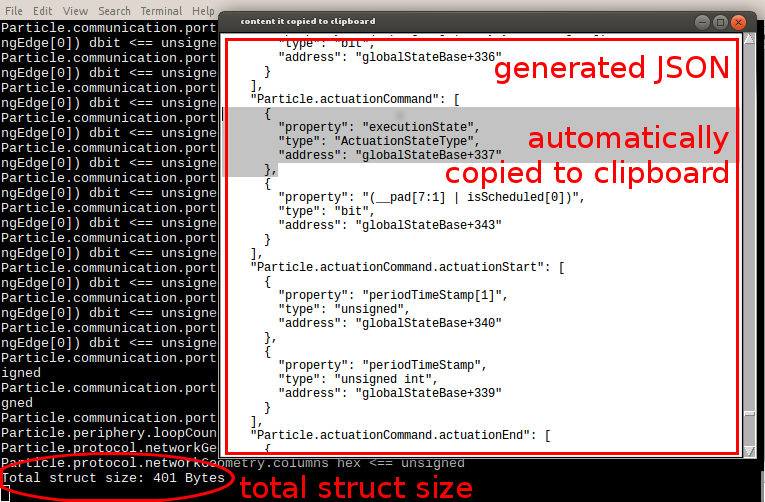

C struct to Json auto-generator
===============================
An autogenerator that generates a JSON description out of C source code. 
The description file is used by the [avrora's](http://compilers.cs.ucla.edu/avrora/) 
simulation particle [platform monitor](https://github.com/ProgrammableMatter/avrora-particle-platform) to translate 
writes onto registers of interrest.

Usage
-----
    python CStructsToRegisterDescriptionJson.py
    
A windows appears showing the output which is also copied to clipboard.

Configuration
-------------
Output adjustments and overrides can be configured in 
    
    JsongConfig.py
    
The source file directory may be adjusted in 

    SourceConfig.py

Example 
-------
Exemplary generated fragments of the particle 
[firmware implementation](https://github.com/ProgrammableMatter/particle-firmware):

    {
      "enums": {
        [...]
        "NodeType": [
          "NODE_TYPE_INVALID",
          "NODE_TYPE_ORPHAN",
          "NODE_TYPE_ORIGIN",
          "NODE_TYPE_INTER_HEAD",
          "NODE_TYPE_INTER_NODE",
          "NODE_TYPE_TAIL",
          "NODE_TYPE_MASTER"
        ],
      },
      "labels": {
        "globalStateBase": 96 /* global struct starts at this address*/
      },
      [...]
      "structs": {
        "Particle.node": [
          {
            "property": "state",
            "type": "StateType",
            "address": "globalStateBase+1"
          },
          {
            "property": "type",
            "type": "NodeType",
            "address": "globalStateBase+3"
          }
        ],
        "Particle.node.address": [
         {
            "property": "row",
            "type": "unsigned",
            "address": "globalStateBase+5"
          },
          {
            "property": "column",
            "type": "unsigned",
            "address": "globalStateBase+6"
          }
        ]
      }
    }

Screenshots
-----------
Autogenerated JSON description out of C-source code.

